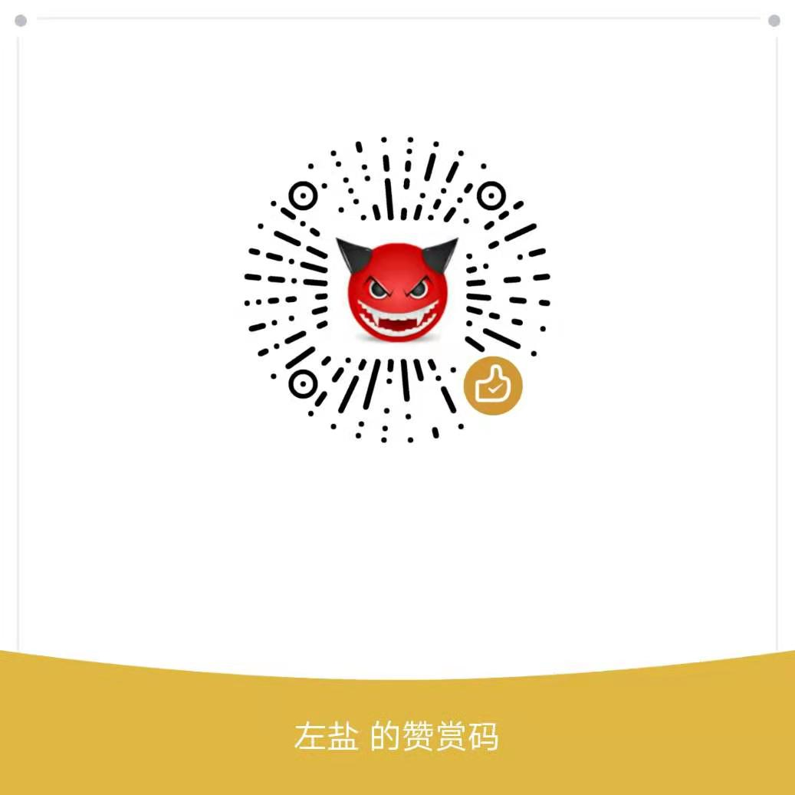

[](https://www.npmjs.com/package/vue-layer)
[](https://www.npmjs.com/package/vue-layer)
[](https://www.npmjs.com/package/vue-layer)
[](https://www.npmjs.com/package/vue-layer)
## vue-layer
install
```shell
npm install vue-layer
```
      // "eslint:recommended"
## Quick Start

在程序入口添加
```js
import Vue from 'vue';
import layer from 'vue-layer'
import 'vue-layer/lib/vue-layer.css';

Vue.prototype.$layer = layer(Vue);
```
全局参数重置
```js
import Vue from 'vue';
import layer from 'vue-layer'
Vue.prototype.$layer = layer({
    msgtime: 3,//目前只有一项，即msg方法的默认消失时间，单位：秒
});
```
调用
```js
this.$layer.alert("找不到对象！");
```

## Attribut
```js
{
  type: 0, //0（信息框，默认）1（页面层）2（iframe层）3（加载层）4（tips层）
  title: '信息',
  content: '',
  area: 'auto',
  offset: 'auto',
  icon: -1,
  btn: '确定',
  time: 0,
  shade: true,//是否显示遮罩
  yes: '',
  cancel: '',
  tips: [0,{}],//支持上右下左四个方向，通过1-4进行方向设定,可以设定tips: [1, '#c00']
  tipsMore: false,//是否允许多个tips
  shadeClose: true,//点击遮罩是否关闭
  maxmin: true,//开启最大化最小化
  scrollbar: true, //是否允许浏览器出现滚动条:默认是允许
  resize: false //是否允许拉伸，默认是不允许
}
```
## Method
```js
 layer.alert(content, [options, yes]);
 // options和yes可以省略， 如果您不愿意写options，则可以直接写确定按钮的函数，即yes
 // content 可以为html
 //yes如果是个function，这会自动添加参数layerid，
 (layerid)=>{
   this.$layer.close(layerid);
 }
```

```js
 layer.confirm(content, [options, yes, cancel]);
  // options，yes和cancel可以省略， 如果您不愿意写options，则可以直接写确定按钮的函数，即yes，或者覆盖默认的cancel方法。PS：yes和cancel方法不能互换
  //content 可以为html
   //yes,cancel如果是个function，这会自动添加参数layerid，
 (layerid)=>{
   this.$layer.close(layerid);
 }
```

```js
 layer.loadding(option);
  // options ={time:3}，3秒自动关闭
  //options = {content:'请等待'} //可传入文字
```

```js
 layer.msg(content, [options, end]);
 // options和end可以省略， 如果您不愿意写options，则可以直接写时间到期的回调即可，即end方法
 // 默认msg的关闭时间为1.5秒
 // content 可以为html
```


```js
 layer.prompt(options, yes);
 //特殊参数: value 要回显的值
 //formType: 1text,2password,3textarea
```


```js
layer.tips(content, follow, options);
//content 可以为html
//follow对css选择器，用来定位目标
```
```js
layer.iframe({
  content: {
    content: componentName, //传递的组件对象
    parent: this,//当前的vue对象
    data:{}//props
  },
  area:['800px','600px'],
  title: 'title'，
  cancel:()=>{//关闭事件
     alert('关闭iframe');
  }
});
// data参数可认为是componentName的props，同时 该方法会自动添加一个key为layerid的值， 该值为创建层的id， 可以直接用来关闭该层
// options参数直接写到json里即可，比如title
```
```js
layer.close(id);
```
```js
layer.closeAll(type);
```

```js
//弹窗最大化
layer.full(layerid);
```
```js
//弹窗最小化
layer.min(layerid);
```
```js
//还原弹窗
layer.restore(layerid);
```


### 关于this.$layer.iframe
 其实使用iframe层，除了操作方便外，主要的目的是隔离代码， 降低代码复杂度。而在vue中，组件就是功能块的基本单位了，所以vue-layer中并不存在iframe的DOM元素，这里用的都是组件。 这里的content有三个参数：

 ##### content:
  此参数为组件对象， 比如
  ```js
   import editFrom from './edir-form.vue';
```
  此处content就为editFrom即可。

  ##### parent:

  此参数其实就是当前调用layer的vue对象， 即this即可。在editForm中可以直接使用， this.$parent来获取调用layer的vue对象，然后父子传值神马的，就很easy，当然也可以直接使用vuex，就不用this.$parent了,另外自动注入了原始数据的浅拷贝lydata,也可以直接赋值这个数据来同步父对象的数据

  ##### data:
  此参数可认为是editForm的props，传递到iframe后是这个数据的深拷贝，改变数据不会影响来源数据，然后你懂得。
  > * 该方法会自动添加一个key为layerid的值， 该值为创建层的id， 可以直接使用
  > * 该方法会自动添加一个key为lydata的值， 该值为data的浅拷贝， 当iframe要更改父窗口传递的数据的时候，可以直接使用lydata来修改，对于表单使用非常方便

结果即为：
```js
methods:{
   eidt() {
	  this.$layer.iframe({
		content: {
		  content: editForm, //传递的组件对象
		  parent: this,//当前的vue对象
		  data:{
        info:{a:1}
      }//props
		},
		area:['800px','600px'],
		title:"editForm"
	  });
  }
}
```
iframe组件中
```js
export default {
  data() {
    return {
      form: {
      }
    };
  },
  props: {
    info: {
      type: Object,
      default: () => {
        return {};
      }
    },
    layerid: {
      type: String,
      default: ""
    },
    lydata: {
      type: Object,
      default: () => {
        return {};
      }
    }
  },
  methods: {
    onSubmit() {
      this.$layer.msg("提交成功", () => {
        this.lydata.info.name = this.form.name;
        this.$layer.close(this.layerid);
      });
    },
    cancel() {
      this.$layer.close(this.layerid);
    }
  },
  mounted() {
    this.form = this.info;
  }
};
```


### 样式调整
该包的css都为vl-notice开头， 需要重写css样式，覆盖即可

### 觉的作者付出的时间和精力有价值，就给作者买杯咖啡吧
 

 ### 更新日志

 <a href="https://github.com/zuoyanart/vue-layer/releases">更新日志</a>